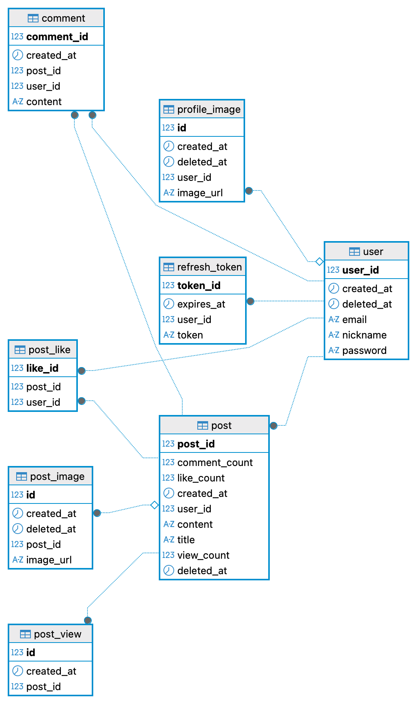

# 🎙️openSquare

## Back-end 소개

- 러닝 커뮤니티를 주제로 `서로 소통하는 커뮤니티` 프로젝트입니다.
- `express`로 서버를 구현하고, `MySQL`로 db를 사용했습니다.
- 개발은 초기 프로젝트 설정부터, db 생성 및 연결, 서버 연결, 프론트엔드 연결까지 구현했습니다.
- MVC 패턴 기반으로 구현했습니다.

### 개발 인원 및 기간

- 개발기간 :  2026-05-31 ~ 2026-08-09
- 개발 인원 : 프론트엔드/백엔드 1명 (본인)

### 사용 기술 및 tools
**Backend**
- Spring Boot 4.0.6
- Spring Data JPA
- Spring Security (JWT 기반 인증)
- Gradle

**Database**
- MySQL 8.0
- Redis

**Infra / DevOps**
- AWS (EC2, S3, VPC, Route53 등)
- Docker
- Kubernetes (kubeadm)
- Helm
- ArgoCD (GitOps)
- GitHub Actions (CI/CD)

**Monitoring / Logging**
- Prometheus / Grafana
- Loki / Promtail


### Front-end
- <a href="https://github.com/100-hours-a-week/4-mond-community-FE">Front-end Github</a>

### 서비스 시연 영상
- https://youtu.be/ElOrnk6t738?si=hC_jWh-UM60Bkh4Y

### 📁 폴더 구조

<details>
  <summary><b>폴더 구조 보기/숨기기 (클릭)</b></summary>
  <div markdown="1">

```text
├── .github/
│   ├── ISSUE_TEMPLATE/
│   └── workflows/
│       └── deploy.yaml
├── .gradle/
├── .idea/
├── build/
├── gradle/
├── helm/
│   ├── argocd/
│   │   ├── kube-prometheus-stack-application.yaml
│   │   ├── loki-application.yaml
│   │   ├── mondcommunity-app.yaml
│   │   └── promtail-application.yaml
│   └── mondcomunity_chart/
│       ├── templates/
│       │   ├── config.yaml
│       │   ├── deployment.yaml
│       │   ├── ingress.yaml
│       │   ├── rbac.yaml
│       │   ├── redis.yaml
│       │   ├── sealed-secret.yaml
│       │   ├── service.yaml
│       │   └── servicemonitor.yaml
│       ├── Chart.yaml
│       └── values.yaml
├── root-app.yaml
├── src/
│   ├── main/
│   │   ├── java/
│   │   │   └── com/
│   │   │       └── example/
│   │   │           └── community/
│   │   │               ├── auth/
│   │   │               ├── comment/
│   │   │               ├── global/
│   │   │               ├── image/
│   │   │               ├── post/
│   │   │               ├── postlike/
│   │   │               ├── postview/
│   │   │               ├── refreshtoken/
│   │   │               ├── user/
│   │   │               └── KtbWeekly2Application.java
│   │   └── resources/
│   │       ├── application.yml
│   │       └── application-test.yaml
│   └── test/
├── uploads/
├── .env
├── .gitattributes
├── .gitignore
├── build.gradle
├── deploy.sh
├── docker-compose.yml
├── Dockerfile
├── gradlew
├── gradlew.bat
└── KTB_WEEKLY2.iml
```
  </div>
</details> 

<br/>

## 서버 설계
### 서버 구조

| 도메인 | Controller | Service | Repository |
| --- | --- | --- | --- |
| **인증 (Auth)** | `AuthController` | `AuthService` | `UserRepository` |
| **유저 (User)** | `UserController` | `UserService` | `UserRepository` |
| **게시글 (Post)** | `PostController` | `PostService` | `PostRepository` |
| **댓글 (Comment)** | `CommentController` | `CommentService` | `CommentRepository` |
| **좋아요 (Like)** | `PostLikeController` | `PostLikeService` | `PostLikeRepository` |
| **게시글 이미지** | `PostImageController` | `S3Service` | `PostImageRepository` |
| **프로필 이미지** | `ProfileImageController` | `S3Service` | `ProfileImageRepository` |

### 구현 기능

#### Users
```
- 회원가입, 로그인, 비밀번호 변경 기능 구현
- 비밀번호는 BCrypt로 암호화하여 저장
- JWT 기반 인증 처리 (Access Token + Refresh Token 발급 및 로테이션)
- Refresh Token을 이용한 Access Token 재발급 엔드포인트 구현
- 커스텀 인증 필터를 통해 유효한 토큰을 가진 요청만 처리
- 로그아웃 시 클라이언트 토큰 무효화 처리
- 프로필 이미지는 S3 Presigned URL 방식으로 업로드, DB에는 이미지 URL만 저장
- 확장자 화이트리스트 검증으로 업로드 파일 형식 제한
```

#### Posts
```
- 게시글 CRUD 기능 구현
- 커서 기반 페이지네이션으로 목록 조회 성능 확보
- 조회수는 Redis로 구현
- 게시글 이미지는 S3 Presigned URL 방식으로 업로드, nullable post_id로 임시 저장 후 게시글 생성 시 연결
- 인증 필터를 통해 유효한 토큰을 가진 유저 요청만 처리
```

#### Comments
```
- 댓글 CRUD 기능 구현
- 인증 필터를 통해 유효한 토큰을 가진 유저 요청만 처리
```
#### Likes
```
- 게시글 좋아요 기능 구현
- post_like를 별도 테이블로 분리하여 중복 좋아요 방지
```

<br/>

## 데이터베이스 설계
### 요구사항 분석
`유저 관리`
- 사용자는 이메일, 프로필 이미지, 비밀번호, 닉네임 정보를 포함하는 유저 관리
- 각 유저는 고유한 식별자를 가지고 있으며, 이메일과 닉네임은 유니크하게 설정하여 중복 방지

`게시글 관리`
- 사용자가 제목, 내용, 이미지, 작성일시, 수정일시 등의 정보를 포함하는 게시글 관리
- 게시글은 작성자를 참조하여 관계를 설정

`댓글 관리`
- 사용자가 내용, 작성자, 작성일시 등의 정보를 포함하는 댓글 관리
- 댓글은 어떤 게시글에 속해 있는지 나타내는 참조 포함

`좋아요 관리`
- 사용자와 게시글 간의 좋아요 관계를 별도 테이블로 관리하여 중복 좋아요 방지

`인증 관리`
- JWT Access Token / Refresh Token 기반으로 사용자의 로그인 상태 관리
- Refresh Token 만료 시간, 로테이션 정보를 저장하여 토큰 재발급 추적

### 모델링
`E-R Diagram`  
요구사항을 기반으로 모델링한 E-R Diagram입니다.  
<br/>

<br/>

## 트러블 슈팅
### 조회수 동시성 처리 이슈

- 문제: 동시에 여러 요청이 몰릴 때 조회수 카운트가 부정확하게 집계
- 원인: 단순 +1 업데이트 쿼리가 동시성 상황에서 레이스 컨디션 발생
- 해결: Redis의 원자적 연산(INCR)으로 카운트 처리, post_view 테이블로 유저별 중복 조회 방지

### 검색 기능 성능 이슈

- 문제: 게시글 제목/본문 검색 시 응답 속도 저하, 데이터 증가할수록 심화
- 원인: LIKE '%keyword%' 방식의 풀 테이블 스캔으로 인덱스 활용 불가
- 해결: MySQL FULLTEXT 인덱스(ngram parser) 적용으로 인덱스 기반 검색 전환, 한글 형태소 특성상 ngram parser 사용
<br/>

## 프로젝트 후기
프로젝트를 구현하면서 어떻게 설계해야할지를 고민할 수 있었던 프로젝트였다.


<br/>
<br/>
<br/>

<p align="center">
  
</p>
